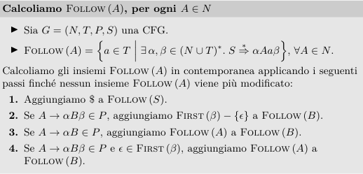

# OGA

## Beni e bisogni

**Bene**: inteso come un bene economico, cioè un qualcosa X che è scarsa atta a soddisfare un bisogno.

**Bisogno**: sensazione di insoddisfazione accompagnata dalla consapovolezza dell’esistenza di un bene che possa mitigare questa sensazione.

I bisogni possono essere:

* **fisici**, cioè sono relativi alla sopravvivenza degli esseri umani. Sono anche detti bisogni individuali, naturali o di esistenza.
* **psichici**, cioè collegati allo stato psichico degli umani. Sono anche detti bisogni sociali, relazionali o di civiltà.

### Classificazioni e caratteristiche

Esistono diverse **classificazioni** di bisogni:

* risorgenza **(frequenza)**
  * continui
  * periodici
  * eccezionali
* soggettività **(quanto sono variabili)**
  * variabili nel tempo
  * variabili nello spazio
* **priorità**
  * indifferibili (es. la fame, non puoi rimandare a più tardi)
  * differibili (puoi rimandare)

I bisogni sono **indipendenti e complementari** agli atteggiamenti degli esseri umani (es. mangiare e bere)

### Soddisfare i bisogni: fasi

Per poter soddisfare i bisogni si attraversano due fasi:

* **cognitiva**: dove si **seleziona** (sceglie) un bene (attività **morale**) e si **selezionano le vie più convenienti** per procurarselo (attività **economica**) anche **valutando le alternative** (attività **tecnica**)
* **operativa**: dove si acquisisce e si usa

### Principio del minimo mezzo

Massimo risultato col minimo sforzo.

### Storia dei bisogni

Sin dall'antichità, gli atti relativi al soddisfacimento dei bisogni umani sono svolti da **gruppi economici**. In ordine:

* **autarchico**: gruppo **chiuso**; ha una politica rivolta **all'oggi proprio e al domani proprio**. Si occupa del consumo e di tutta la produzione e produceva un surplus che conservano per loro stessi.
* **specializzato**: si apre al commercio con altri gruppi; si specializza in alcune produzioni e acquista le altre presso altri gruppi economici. Ha sia la politica dall'oggi proprio al domani proprio, dall'oggi e domani **altrui**.
* **diversificato**: nasce il gruppo **bipartito** con due entità: gruppo economico **di produzione** e **di consumo** che si dedicano rispettivamente ad attività **creative** e a quelle **erogative**. Esempio: famiglie (consumo), imprese (produzione).

### Differenza tra soddisfacimento diretto e indiretto

In quello **diretto** il consumo viene affidato alle **famiglie** che vengono chiamate **unità di consumo**.

In quello **indiretto**, prima c'è la **produzione** che viene affidata alle **aziende** (chiamate **unità di produzione**).

### Cosa ha bisogno un gruppo economico

Il gruppo economico per svolgere la sua funzione, ossia produzione e consumo, deve dotarsi dei mezzi necessari: **beni e persone**

## Azienda

### Che cos'è

L'azienda è l'unità operativa mediante la quale i gruppi umani attuano la produzione dei beni al fine del soddisfacimento dei bisogni.

Bullet list di definizioni:

* strumento dell'operare umano in campo economico
* istituto economico atto a perdurare
* sistema di elementi orientato al raggiungimento di un fine
* unità economica elementare
* coordinazione economica in atto che stabilisce rapporti biunivoci con l'ambiente in cui opera

### Azienda individuale vs. azienda collettiva vs. privata vs. pubblica

L'azienda individuale è formata da un singolo individuo tipicamente.

L'azienda collettiva è formata da più individui e si distingue in:

* **privata**: dedicata alla produzione di beni per soddisfare i **bisogni individuali**
* **pubblica**: dedicata alla produzione di beni per soddisfare i **bisogni della collettività** (enti, Stato, Comune, Regioni...)

### Finanziamenti

La produzione e il consumo necessitano di **mezzi finanziari**. Si forma così un **impegno collaterale** attinente alla fornitura di questi mezzi: il **finanziamento alla produzione o al consumo**; le aziende che si dedicano a questo genere di cose, sono le aziende **finanziarie** (anch'esse aziende di produzione).

### Trade offer: aziende e famiglie

### Perché si viene a creare l'azienda? Imprese vs. associazioni

Le motivazioni alla base dell'istituzione di un'azienda possono essere diverse, cioè basate sui **fini**.

* a scopo di **lucro**: **imprese**
* finalità **generali di utilità**: non di lucro, quindi non imprese
  * fondazioni o associazioni
  * enti socio-politici

### Da cosa è costituita un'azienda

Da tre cose:

* il **lavoro**, chiamato **organismo personale**
* il **capitale** chiamato **dotazione patrimoniale**
* l'**organizzazione** dal quale scaturisce il rapporto dinamico tra il lavoro e il capitale

### Quali sono i ruoli nell'azienda?

Possono essere di tre tipi, e sono tutti atti allo svolgimento dell'attività:

* **volitivo**: concepimento delle linee guida. L'organo volitivo è conosciuto come "**soggetto istituzionale**".
* **direttivo**: concepimento delle linee strategico-tattiche
* **esecutivo**: attuazione delle linee direttive

### Chi è il soggetto istituzionale?

L'organo volitivo.

### Quali sono le fasi della vita aziendale?

1. Si decide di mettere in piedi un'azienda: si ha un'**idea** e si **progettano** le linee fondamentali. Questa attività la svolge il **soggetto istituzionale** (organo volitivo). Questa fase prende il nome di **lavoro volitivo**.
2. Ci si mettono i soldi: **capitale monetario (o finanziario)**. Questo capitale fa il suo ingresso in azienda in forma **monetaria**
3. Si ha l'acquisizione dei **fattori produttivi**: il **lavoro** (direttivo ed esecutivo), e **utilità** (materiali, come i macchinari, e immateriali come i brevetti). Con la loro acquisizione si ha il passaggio da **capitale generico (o investito)** al **capitale specifico (o disponibile)**

#### Capacità vs. utilità potenziale - Attivazione del capitale

Il **lavoro** all'inizio è **capacità potenziale**, mentre il **capitale** è **utilità potenziale**. Tramite un **piano**, devo **sfruttare le potenzialità**, per fare in modo che le capacità **insite** agiscano sull'utilità del capitale. Il capitale in questo modo passa da **inerte** a **attivato**.

## Organizzazione

Funge da moltiplicatore, o riduttore, nei confronti delle capacità e utilità presenti nel lavoro e nel capitale. (**combina le due cose**)

## Gestione

Insieme delle azioni che le persone svolgono applicando le loro capacità alle utilità del capitale.

Ha due momenti:

1. **Astratto (cognitivo)** : decisioni sui comportamenti da attuare --> atti amministrativi
2. **Concreto (operativo)**: attuazione dei comportamenti --> fatti amministrativi (operazioni)

C'è anche una terza fase, ossia quella "post-operativa", anche conosciuta come **di controllo**

### Gli effetti delle operazioni sul capitale

Possono essere **qualitativi** modificando la composizione del capitale (es. denaro proprio, in prestito, investito), o **quantitativi** modificandone la dimensione.&#x20;

## Funzioni amministrative

### Qual è il ciclo di vita di un'impresa?

Si divide in tre fasi:

1. **Istituzione** (creazione): funzioni amministrative **istituzionali**
2. **Funzionamento** (qualunque fase dopo la nascita prima della morte): funzioni amministrative **funzionamento**
3. **Terminale** (morte / fallimento): funzioni amministrative **terminali**

Il **sistema delle funzioni** è il collegamento e l'interdipendenza tra queste fasi.

Raggruppiamo le funzioni in due grandi gruppi:

* **processi**: attività aziendali (processi di vendita e produzione)
* **combinazioni di processi**

### Incertezza

L'incertezza è data dalla **non consapevolezza degli effetti** di determinate decisioni ed azioni.

La gestione aziendale si svolge _sempre_ in condizioni di incertezza.

Non è calcolabile.

#### A cosa porta

Può dar luogo a decisioni antifunzionali (**decisioni sbagliate** che portano alle operazioni antifunzionali) o **decisioni funzionali**.

Le **decisioni funzionali** possono portare a operazioni funzionali, dove il rischio è calcolabile. oppure anti-funzionali.

Nelle **operazioni antifunzionali** agisce il rischio, che provoca disagio tra decisioni prese e decisioni convenienti, oppure disagio provocato dall'incongruenza di ciò che sarebbe stato meglio fare e ciò che è stato fatto.

## Azienda individuale

Nell'azienda individuale, il soggetto giuridico e quello economico sono la stessa persona.

### La persona nell'azienda individuale, è sempre unica?

No, possono esserci dei lavoratori subordinati.

### Chi è il soggetto giuridico?

La persona sulla quale convergono diritti e obbligazioni relativi all'azienda.

### Chi è il soggetto economico?

La persona che controlla l'azienda, ne influenza le scelte e trae i maggiori vantaggi dalla sua attività.

### Chi è il titolare?

Il **titolare** (conosciuto anche come **soggetto istituzionale** o **imprenditore**) svolge una plurità di ruoli:

* contrae la **titolarità dei diritti e delle obbligazioni**
* **sopporta il rischio**
* presta il proprio lavoro **sia volitivo che direttivo**
* apporta (ci mette) il **capitale**
* **esercita il potere decisionale**

### Accollo delle responsabilità

Spesso il titolare non può svolgere tutto da solo sia dal punto di vista delle attività del lavoro che nelle disponibilità del capitale, quindi **si rivolge a due mercati**:

* mercato del **lavoro** (per cercare prestatori di lavoro)
  * **dipendenti**
  * **autonomi** (ha più libertà)
* mercato del **capitale** (cercare fornitori di capitale)
  * di rischio (**denaro proprio** dell'imprenditore)
  * **di credito**

Nell'azienda individuale, il titolare può delegare ad un'altra persone il potere di decidere le linee fondamentali della gestione, ossia il **direttore/amministratore**.

Se ciò avviene, il titolare resta sempre il soggetto giuridico, ma perde la qualifica di soggetto economico.

## Società per azioni

Il **potere decisionale** è nelle mani dell'**assemblea dei soci** (**consiglio d'amministrazione o all'amministratore delegato**) e in particolare al **top management**. Tutti questi sono **soggetti economici**

Il **rischio** resta ai soci ma **limitatamente** all'importo delle **azioni** sottoscritte.

La **responsabilità** si trasferisce alla società, in virtù del riconoscimento legale della personalità giuridica. **La società è il soggetto giuridico.**

## Azienda e ordine

### Azienda

Un complesso composto da **sottosistemi**, ognuno di questi è atto a svolgere una diversa attività, funzione o ha una diversa dimensione.

### Elementi fondamentali

Lavoro (elemento umano) e capitale (elemento materiale). **Dipendono l'uno dall'altro**, e quindi si può dire che l'azienda è un sistema.

Devono essere **coerenti**, cioè orientati verso lo **stesso punto d'arrivo**.

Devono essere **in ordine**, cioè in **relazione** secondo un criterio di razionalità e convenienza (qualità e quantità).

Ci sono **tre categorie** di relazioni:

1. ambito del **lavoro**: le persone devono essere presenti nel modo più adatto per esaltare la forza del lavoro
2. ambito del **capitale**: i beni devono essere presenti nel modo più adatto per esaltare l'utilità patrimoniale
3. tra lavoro e capitale, la **forza lavoro deve combinarsi** al meglio con l'utilità dei beni

### Che fa la direzione?

Coordina questi sottosistemi secondo i tre ambiti.

### Unità dell'azienda

Deriva dalla somma delle singoli componenti (lavoro e capitale)

## I sistemi

Un sistema è:

* dinamico: carattereizzato da un movimento continuo degli elementi che lo compongono
* strumentale: poiché è lo strumento attraverso il quale gli individui soddisfano i loro bisogni
* aperto: si sviluppa in collegamento continuo con l'ambiente esterno, dal quale acquisisce fattori produttivi e cede prodotti

L'ambiente è in continuo cambiamento, e l'azienda deve essere adattabile al cambiamento.

## L'ordine

L'ordine è il **presupposto** dell'**economicità** (convenienza economica).

Può essere di tipo:

* **combinatorio**: riguarda i fattori produttivi (tutti gli elementi necessari nella produzione di un bene)
* **sistematico**: operazioni
* **composizione**: rapporti con l'ambiente

Ciascuno di loro si manifesta **nella qualità, nel tempo e nella quantità.**

### Equilibrio economico e flussi

Se i ricavi sono tali da reintegrare oltre che i costi storici (quelli iniziali), anche il deficit dato dalla differenza tra i costi stessi ed i costi prospettici di riacquisto dei fattori, allora quello è un **equilibrio economico**.

#### Costi vs. Ricavi

I costi "cedono energia" dell'azienda tramite l'**acquisizione dei fattori produttivi** e **l'utilizzo dei fattori produttivi**.

I **ricavi** "reintegrano l'energia" dell'azienda tramite la **vendita del prodotto ottenuto coi fattori**

**Le leggi magiche**

* `R >= C`: **inclusione** tra i costi dei fattori produttivi del **costo del capitale di rischio**
* `R >= C + M`: **esclusione** tra i costi dei fattori produttivi del **costo del capitale di rischio**

Nella seconda formula, M sono i costi figurativi (come i compensi al titolare e ai dipendenti, quello per il rischio sopportato con l-investimento, e interesse patrimoniale)

#### Redditività vs. Economicità

La **redditività** esprime la capacità della gestione di **generare redditi positivi**.

L'**economicità** esprime la capacità della gestione di mettersi in **equilibrio economico**.

I due coincidono quando il reddito prodotto è equo ed è assicurato per un lungo periodo di tempo.

#### Forza di reddito

La **forza di reddito** è la capacità dell'azienda di produrre redditi positivi in maniera autonoma.

#### Proiezione

La proiezione nel tempo dell'equilibrio economico richiede la considerazione dei costi e dei ricavi (attuali e futuri).

È una previsione, come un andameno sul grafico.
