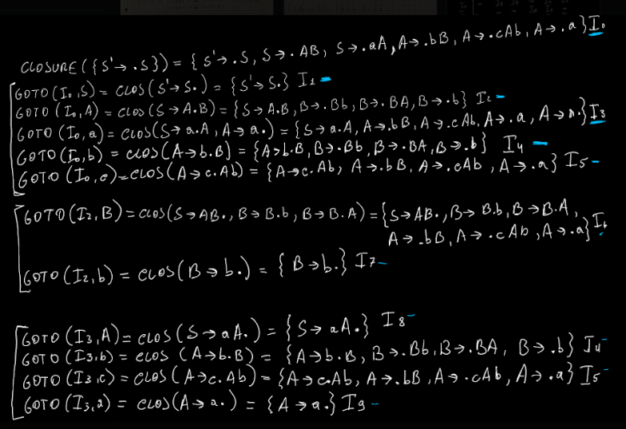

# 🖥 Linguaggi e Compilatori

## ER: costruire NFA a partire da un'espressione regolare


Ci sono due passi fondamentali:

1. Costruire l'**albero astratto**. Per farlo basta "risolvere" l'espressione regolare in maniera "spezzettata", a blocchi di parentesi.
2. **Disegnare l'automa** NFA **a pezzi**

### Testo d'esempio

L'espressione è la seguente:

```
(a|c)*(c|b)*(abc)*
```

### Regole per fare l'albero astratto

Regole da tenere ben presente:

1. L'associatività **a sinistra**
2.  OR (a|c):

    ```
      |
     / \
    a   b
    ```


3.  AND (abc)\*:

    ```
        *
        |
        °
       / \
      °   c
     / \
    a   b
    ```

### Passo 1: l'albero astratto

```
            °
           /  \
          /    \
         /      \
        /        \
       /          \
      °            *
     / \            \
    /   \            °
   *     *          / \
   |     |         /   \
  / \   / \       °     c
 a   c c   b     / \
                a   b
```

### Passo 2: l'automa

Mi disegno i vari automi e li unisco tra loro.

### Regole per disegnare l'automa

* Disegno prima gli automi semplici (atomici, esempio, automa che riconosce a, automa che riconosce c) e li unisco
  * Sebbene possa aver disegnato già un altro automa in precedenza che facesse la stessa cosa, per ogni ramo **devo disegnare un automa diverso**\
    Esempio: se ho già disegnato un automa che riconosce a e mi ritrovo a dover disegnare un ramo con un automa che riconosce a **devo disegnarlo di nuovo**
* **Concatenazione (or)**
  * aggiungo uno stato vuoto iniziale
  * faccio due branch con gli automi creati in precedenza
  * aggiungo uno stato vuoto alla fine
  * i due stati supplementari avranno epsilon nelle frecce
* **Unione (and)**
  * prendo i due sottoautomi e li unisco tra loro andando a creare un nuovo stato
  * quest ultimo avrà come nome "stato finale sottoautoma1 / stato iniziale sottoautoma2"
* **Kleine (\*)**
  * come concatenazione (stati supplementari) ma al primo fai una freccia che va all'ultimo e il penultimo va nel secondo. Ovviamente entrambe le frecce hanno epsilon.&#x20;

### Disegno dell'automa

Guardando l'albero astratto, parti dall'estrema sinistra e cominci a fare piccoli sottoautomi. Man mano che risali l'albero unisci a seconda di quello che trovi.

.png>)

## NFA: usare subset construction per costruire un DFA partendo da un NFA

### Traccia

.png>)

### Cosa bisogna fare

1. Si sceglie uno stato iniziale, 0 nel nostro caso, e si calcola la sua ε-closure ossia seguendo le frecce con la ε, bisogna vedere dove si finisce. Questo andrà a formare il nostro stato di partenza. Nel nostro caso: {0,2,4) = A.
2. Si calcola la move per lo stato A: per ogni stato in A vedo dove vanno gli stati con tutti gli input dell'automa, quindi, prima con a, poi con b e poi con c. Devo inoltre calcolare ogni volta la ε-closure. Ogni volta che trovo un nuovo gruppo "che non ho mai visto" creo un nuovo stato. Esempio: se calcolo la move di A, il gruppo di prima, con l'input a, ottengo ε-closure({1,2}) = {0,1,2,4}. Siccome non ho mai visto in precedenza questa partizione, posso chiamarla B. In seguito, calcolerò anche le sue move.
3. Continuo finché non trovo altri stati

### Calcoli e procedimento

Promemoria efficaci:

* dopo il secondo uguale, devo **SEMPRE** riscrivere gli stati che avevo scritto dopo il primo uguale
* lo stato vuoto è uno stato come tutti gli altri. In quanto tale ha un nome. Alla fine, verrà rappresentato come uno stato che non ha frecce entranti verso gli altri stati, e ogni input andrà in sé stesso.
* se non finisco da nessuna parte, scriverò ∅

1. Stato in D: ε-closure(0) = {0,2,4} (A)
2. ε**-**closure(move(A, a)) = ε-closure({1,2}) = {0,1,2,4} (B) <-- dopo il primo uguale: "dove vado con input a da 0,2,4 (A)?". Dopo il secondo uguale: "dove vado con ε da 1 e 2?".
3. ε**-**closure(move(A, b)) = ε-closure({1}) = {1} (C)
4. ε**-**closure(move(A, c)) = ε-closure({3}) = {3} (D)\
   Bene, ora ho come nuovi stati B, C e D. Devo continuare.
5. ε**-**closure(move(B, a)) = ε-closure({1, 2}) = (B) <-- me l'ero già calcolato al passo 2
6. ε**-**closure(move(B, b)) = ε-closure({1, 2}) = (B)
7. ε**-**closure(move(B, c)) = ε-closure({3, 4}) = {0,2,3,4} (E)
8. ε**-**closure(move(C, a)) = ε-closure({∅}) = {∅} (G)
9. ε**-**closure(move(C, b)) = ε-closure({2}) = {0,2,4} (A)
10. ε**-**closure(move(C, c)) = ε-closure({4}) = {0,2,4} (A)
11. ε**-**closure(move(D, a)) = ε-closure({3}) = (D)
12. ε**-**closure(move(D, b)) = ε-closure({∅}) = {∅} (G)
13. ε**-**closure(move(D, c)) = ε-closure({2}) = (A)
14. ε**-**closure(move(E, a)) = ε-closure({1, 2, 3}) = {0, 1, 2, 3, 4} (F)
15. ε**-**closure(move(E, b)) = ε-closure({1}) = (C)
16. ε**-**closure(move(E, c)) = ε-closure({2, 3}) = {0, 2, 3, 4} (E)
17. ε**-**closure(move(F, a)) = ε-closure({1, 2, 3}) = (F)
18. ε**-**closure(move(F, b)) = ε-closure({1, 2}) = (B)
19. ε**-**closure(move(F, c)) = ε-closure({2, 3, 4}) = (E)
20. G è uno stato vuoto. Siccome, tra le altre cose non ha archi uscenti, posso non rappresentarlo.&#x20;

### Va bene, e adesso? Il DFA

Gli stati finali del DFA sono tutti quelli in cui, nel lavoro fatto in precedenza compare almeno uno stato finale dell'NFA.

Ad esempio, E contiene 2 e 4, dunque è sicuramente uno stato finale.

Nell'NFA gli stati finali erano 2 e 4.

Posso quindi disegnare l'automa (va bene anche la forma tabellare, in grassetto gli stati finali):

| stato / input | a | b | c |
| ------------- | - | - | - |
| **A**         | B | C | D |
| **B**         | B | B | E |
| **C**         | G | A | A |
| **D**         | D | G | A |
| **E**         | F | C | E |
| **F**         | F | B | E |
| **G**         | G | G | G |

## MIN: minimizzare gli stati di un DFA

### Traccia

 (1).png>)

### Risoluzione

1. Scrivere fisso le seguenti cose:
   1. sia Π partizione iniziale
   2. sia Πnew partizione di lavoro
   3. sia Πf DFA minimizzato
   4. Σ = {a,b} <-- in questo caso a e b perché i simboli usati nell'automa sono solo questi due
   5. Π = \{{1,3,9}, {0,2,4,5,7,8\}} <-- rispettivamente gli stati finali e i restanti
2.  Analizza le partizioni che hai creato. Se le dividi, analizza prima quelle divise. **Ogni volta che dividi** dai un numero a quella partizione, sarà più comodo per altri calcoli che verranno fatti dopo. Costruisci la solita tabella "stato/input", avendo cura di segnare non tanto lo stato di destinazione, ma la partizione in cui si trova lo stato di destinazione.\
    \
    {1, 3, 9} (1), {0,2,4,5,7,8} (2) <-- tra parentesi tonde il "nome della partizione"\


    | stato / input | a     | b     |
    | ------------- | ----- | ----- |
    | 1             | 5 (2) | 3 (1) |
    | 3             | 9 (2) | 0 (2) |
    | 9             | 2 (2) | 3 (1) |

    Gli stati 1 e 9, a fronte dello stesso input vanno nella stessa partizione di output. Possono rimanere insieme, ma lo stato 3 se ne va per conto suo.\
    **Πnew = {1, 9}(1) {3}(3) {2, 5, 8, 0, 4, 7} (2)**\
    \
    Il 3 non ha discrepanze e quindi non verrà più analizzato. (quando ho un singleton non lo considero).
3.  Analizzo la nuova partizione {1, 9}

    | stato / input | a     | b     |
    | ------------- | ----- | ----- |
    | 1             | 5 (2) | 3 (3) |
    | 9             | 2 (2) | 3 (3) |

    Tutto ok. Non posso fondere più di così.
4.  Analizzo la partizione 2

    | stato / input | a     | b     |
    | ------------- | ----- | ----- |
    | 0             | 9 (1) | 2 (2) |
    | 2             | 0 (2) | 1 (1) |
    | 4             | 1 (1) | 2 (2) |
    | 5             | 4 (2) | 1 (1) |
    | 7             | 1 (1) | 8 (2) |
    | 8             | 7 (2) | 9 (1) |

    Posso quindi staccare sia 0 4 7 che 2 5 8, sempre per il solito motivo che a fronte dello stesso input vanno nelle stesse partizioni di destinazione.\
    \
    **Πnew = {1, 9}(1) {3}(3) {2, 5, 8} (2) {0, 4, 7)(4)**\
    ****
5. Analizzo le partizioni rimanenti. Sono irriducibili.

|   | a     | b     |
| - | ----- | ----- |
| 0 | 9 (1) | 2 (2) |
| 4 | 1 (1) | 8 (2) |
| 7 | 1 (1) | 8 (2) |

|   | a     | b     |
| - | ----- | ----- |
| 2 | 0 (4) | 1 (1) |
| 5 | 4 (4) | 1 (1) |
| 8 | 7 (4) | 9 (1) |

**Importantissimo:** pure se sono irriducibili devi comunque fare il giro "a vuoto". Finisci SOLO quando non cambi più nulla.

## FAT: fattorizzare una grammatica

### L'idea

Ricordate i monomi e i polinomi fatti a scuola? Ecco, fattorizzare una grammatica vuol dire fare circa la stessa cosa: trovate i monomi simili, fate raccoglimento e con un po' di accortezze avrete fattorizzato una grammatica.&#x20;

### Traccia

A -> <mark style="color:blue;">AaB</mark>c | <mark style="color:purple;">AabC</mark>a | <mark style="color:orange;">AaCb</mark>A | <mark style="color:blue;">AaB</mark>C | <mark style="color:purple;">AabC</mark>B | <mark style="color:orange;">AaCb</mark>B | <mark style="color:blue;">AaB</mark>a | C\
B -> <mark style="background-color:orange;">B</mark>BCB | <mark style="background-color:orange;">B</mark>cC | <mark style="background-color:orange;">B</mark>caA | <mark style="background-color:orange;">B</mark>Cb | <mark style="background-color:orange;">B</mark>Ba | <mark style="background-color:orange;">B</mark>caC | C\
C -> <mark style="color:green;">Cc</mark>Bc | <mark style="background-color:purple;">CA</mark>b | <mark style="color:green;">Cc</mark> | <mark style="background-color:red;">CC</mark>Bb | <mark style="background-color:red;">CC</mark>C | <mark style="background-color:purple;">CA</mark>B | <mark style="color:green;">Cc</mark>Aa | c

### Svolgimento

Identifico i monomi e me li segno in qualche modo nella traccia.

Considero A:

* π = AaB, AabC, AaCb <-- ossia, tutte le parti in comune colorate che ho preso in considerazione quando ho raggruppato i monomi simili
* A --> AaBA' | AabCA'' | AaCbA''' | C <-- prendo le parti "in comune" e per ogni gruppo ci aggiungo un A' poi A'' ecc. Se un monomio sta per conto suo, bisogna metterlo qui.
  * le clausole con ', '' ecc conterranno i "pezzi diversi non in comune" con i monomi raggruppati prima. Esempio:   <mark style="color:blue;">AaB</mark>c e <mark style="color:blue;">AaB</mark>C in comune hanno AaB. Le loro parti non in comune sono c e C, che sono quelle che andranno a finire nella prima clausola.&#x20;
* A' --> c | C | a
* A'' --> a | B
* A''' --> A | B

Considero B:

* π = B
* B --> BB' | C
* B' --> BCB | cC | caA | Cb | Ba | caC

Considero C:

* π = Cc, CA, CC
* C --> CcC' | CAC'' | CCC''' | c
* C' --> BC | Aa | ε
* C'' --> b | B
* C''' --> Bb | C

## RIC: eliminare la ricorsione sinistra da una grammatica

### Regolette

<mark style="color:red;">SEGUIRE IL SACROSANTO ORDINE</mark>

1. PRIMA <mark style="color:red;">sostituisco</mark>, se c'è qualcosa da sostituire: il concetto dei pronomi. Ad esempio ho A -> xA | Bc e B -> Az | Cy, dovrò dunque modificare B -> Az, e quindi avrò B -> xAz | Bcz | Cy
2. POI <mark style="color:red;">elimino</mark> eventuali ricorsioni
   1. nell'esempio di prima: voglio eliminare la ricorsione B -> Bcz
   2. Divido B in due: B -> xAzB' | CyB' e poi B' -> czB' | ε
   3. Il primo pezzo si ottiene riscrivendo B di prima, tranne quella che voglio eliminare e ad ogni produzione gli aggiungo B'
   4. Il secondo pezzo si ottiene scrivendo la parte destra della ricorsiva che volevo togliere, tolgo la B, aggiungo la B' alla fine ed ε
   5. **NB: Se dovessi avere dopo la sostituzione, roba che è ancora sostituibile devo sostituire. Esempio: se sostituisco B -> Ab | c, e A me l'ero già calcolato, devo sostituirlo.**
3. Non ritorno **mai** su una cosa che avevo già analizzato. Il procedimento è lineare, e una volta che ho finito con A, basta, non posso più modificarlo.

### Traccia

A -> xA | By\
B -> Cy | Bw | Az\
C -> Aw | Bz | Cz | x

### Svolgimento

1. Guardo la prima riga. Analizzo A: non ci sono operazioni da effettuare. Non succede nulla. Non ci sono ricorsioni dirette e non possiamo sostituire alcunché. Infatti A -> By, potremmo sostituire B, ma non possiamo farlo adesso perché B non lo abbiamo ancora analizzato.\
   \
   Scrivo:\
   \> Analizzo A: non ci sono operazioni da effettuare
2. Analizzo B: notiamo che B -> Az può essere riscritta: dobbiamo sostituire alla A, la parte destra della produzione di A (che sarebbe xA | By) seguita da z, poiché c'è Az.\
   \
   Applico la regola 1 -> riscrivo pari pari la produzione di B:\
   B -> Cy | Bw | xA\
   e aggiungo z\
   B -> Cy | B**w** | xAz | B**yz**\
   \
   Applico adesso la regoletta 2 -> tolgo le ricorrenze immediate: B -> Bw e B -> Byz.\
   Riscrivo B con tutte le produzioni meno quelle che voglio togliere:\
   B -> CyB' | xAzB' \
   poi, prendo le parti che mi interessano e ci aggiungo B' + simbolo di vuoto come produzione finale:\
   B' -> **w**B' | **yz**B' | e
3. Riscrivo la grammatica aggiornata:\
   A -> xA | By\
   B -> CyB' | xAzB' \
   B' -> wB' | yzB' | e\
   C -> Aw | Bz | Cz | x
4. Ho finito con B, ora vado su C.\
   Analizzo C: notiamo che C -> Aw e C -> Bz possono essere riscritti\
   \
   C -> xAw | Byw | CyB'z | xAzB'z | Cz | x\
   \
   Finito il passo 1? No. Possiamo continuare a sostituire!\
   \
   C -> xAw | CyB'yw | xAzB'yw | CyB'z | xAzB'z | Cz | x\
   \
   Finito il passo 1? Sì.\
   \
   Posso togliere le ricorrenze immediate: C -> CyB'yw, C -> CyB'z, C -> Cz\
   \
   Solita cosa: riscrivo tutto C.\
   C -> xAwC' | xAzB'ywC' | xAzB'zC' | xC'\
   C' -> yB'ywC' | yB'zC' | zC' | e
5. Grammatica finale:\
   A -> xA | By\
   B -> CyB' | xAzB' \
   B' -> wB' | yzB' | e\
   C -> xAwC' | xAzB'ywC' | xAzB'zC' | xC'\
   C' -> yB'ywC' | yB'zC' | zC' | e\


## First e follow

### First: TODO

### Follow

Devo avere ben presente questa tabella:


A seconda della follow che sto facendo, mi vado a vedere dove sta la lettera della follow (in quale "monomio").

Siccome si chiama follow, devo vedere in che forma sta tramite la tabella, e regolarmi di conseguenza.

.png>)

follow(C): dove compare C? bBCe -> aggiungo e, primo caso ecc\


## LR(0)

### Traccia

* S' -> S
* S -> AB | aA
* A -> bB | cAb | a
* B -> Bb | BA | b

### Regolette

* **Prima** sposto il pallino di una posizione a destra, **poi** calcolo la chiusura
* la **chiusura** si calcola mettendo l'insieme stesso + tutte le produzioni che hanno a sinistra, il primo simbolo dopo il pallino dell'insieme originale.

### Svolgimento

Inizialmente costruiamo I (é una I di Imola).

Questo insieme si costruisce in questo modo: partiamo da S'. Da S' vado a S, quindi sicuramente metto S' -> S. Poi vado a vedere S dove va: S -> AB | aA. Possiamo continuare ad aggiungere le produzioni di A, ma poi ci fermiamo.&#x20;

**Formalmente**:

Calcoliamo closure di I.&#x20;

I = { S' -> S } J = I

* S' -> •S => S -> •AB non appartiene a I => add
* &#x20;             \=> S -> •aA non appartiene a I => add
* I = { S' -> •S, S -> •AB, S -> •aA }

Continuo:

* S -> •AB -> chi ci sta a destra del pallno? A. Quindi aggiungo tutta la roba di A a quello giá esistente: I = { S' -> •S, S -> •AB, S -> •aA, A -> •bB, A -> cAb, A -> •a }

Continuo:

* S -> •aA => non succede niente perché c'é a piccola, che é terminale.

Poi, aggiungiamo un pallino all'estrema sinistra di ogni parte destra di ogni produzione: { S' -> •S, S -> •AB, S -> •aA, A -> •bB, A -> cAb, A -> •a }

Questo é il mio I0, ovvero il mio insieme di partenza. Da qua, mi calcolo tutti gli altri insiemi, facendomi la goto e la chiusura di ogni produzione.

Prendo tutti i simboli a destra del pallino, e me li metto in colonna quando vado a calcolare goto.

Il ragionamento qua é: chi é che produce •\<simbolo> (nella parte a destra)?\
Es. Nel primo caso: chi é che ha S nella parte destra dopo il pallino? Solo S' -> •S. Siccome sto facendo la goto, sposto il pallino a destra e poi mi calcolo la closure.&#x20;

Nella chiusura devo **SEMPRE** includere l'insieme originale E le produzioni dopo il pallino.\
Ad esempio clos( S -> A•B), mi ritrovo dopo il pallino B, quindi aggiungeró B -> •Bb ecc ecc

1. goto(I0, S) = clos({S' -> S•}) = { S' -> S•} => non abbiamo mai visto questo insieme quindi I1
2. goto(I0, A) = clos({S -> A•B}) = { S' -> A•B, B -> •Bb, B -> •BA, B -> •b }
3. goto(I0, a) = clos({S -> a•A, A -> a•})
4. goto(I0, b) = clos(A -> b•B)
5. goto(I0, c) = clos(A -> c•Ab)

**NB**:  al passo 1, troviamo un qualcosa che ha giá il pallino alla sua estrema destra. Nonostante si tratti di un insieme che non abbiamo mai analizzato, non dobbiamo analizzarlo proprio perché il pallino é giá tutto a destra.

Poi basta, proprio come l'esercizio sulle chiusure, continuo sino a quando non trovo piu nulla di nuovo.



.png>)

.png>)
